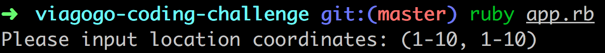
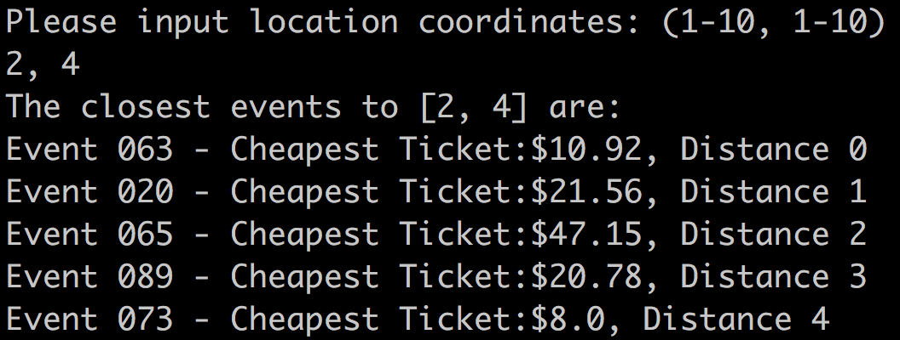

Viagogo Coding Challenge
========================

## Approach

#### TDD the building of these key features:
- A World object: which is 10 by 10 squares
- Events: which have an @location represented by coordinates of 1-10 by 1-10
- The World has @events stored in an array
- The World only accepts Events with a location within the limits of it's 10 by 10 area.
- Events: have a @tickets variable
- Tickets can be stored in an Events @tickets variable  
- An Event's @tickets variable can have 0 or more tickets
- Tickets have a @price which is anything greater than 0 USD
- An Event will understand what the cheapest ticket price available for it is.
- Events can be added to the World
- The World will only allow 1 event per location, so location coordinates must be unique
- A Distance Calculator can calculate the distance between two points
- A Distance Calculator will understand the distance between a user location and each event
- The Distance Calculator will understand Manhattan Distance to calculate this distance
- If event x=(a,b) && event y=(c,d) then Manhattan distance is (a-c) + (b-d)
- The World will understand which events are the closest, from closest to furthest
- Interface will request/accept a user location (as coordinates)
- The interface will use the distance Calculator to know the 5 closest events
- The interface will print the Five closest Events in order from closest to furthest && the price of the cheapest ticket for each event: when provided with a user location.
- For the purpose of this exercise: Events and tickets must be randomly generated when a world is generated.

## Structure

I have structured the program in 6 classes to keep to the single responsibility principle, each object is intended to understand one thing but also avoid unnecessary abstractions.

All classes are required from the lib folder by app.rb allowing for simple a simple interface and result display.

To generate seed data I chose to randomly generate data for the world, including events, & tickets upon instantiating a world (which happens when the interface is instantiated upon running app.rb). This means that the data is different each time. To change this and use specific data, one could remove the method calls in the initialisers for the relevant classes and seed it with a csv file or equivalent, or add events/tickets as they see fit, with the methods built into the classes.  


## To Run

- clone repository

```
git clone git@github.com:tobywinter/viagogo-coding-challenge.git
```
- run bundler

```
bundle install
```

Once in the viagogo-coding-challenge directory

- run the tests

```
rspec
```

- run the App in the console

```
ruby app.rb
```

To see the world, events & tickets generated - and run the find_closest_events method more than once to check that the program words run:

```
irb
require './app.rb'
```
 - --- proceed through program & ignore - then ---

```
interface = Interface.new
```
 - You will see the generated world & events data. Then you can interact with the world using any method to explore how it works:


**Interface methods**
```
  find_closest_events
  request_location
```
**World methods**
```
  events
  add_event
  add_events
  clear_events
  seed_event
  event_locations
  closest_distances_and_events_to(my_location)
  top_five_closest_events(my_location)
```
**Event methods**
```
  name
  location
  tickets
  clear_tickets
  add_ticket(ticket)
  cheapest_ticket
  cheapest_ticket_price
```
**Ticket methods**
```
  price
```
**DistanceCalculator methods**
```
  between(point_a, point_b)
  to_locations(my_location, other_locations)

```

## Screenshots
#### Running the App



#### Displaying the results



## Improvements

Given time to develop:
- I would build a front-end one page display.
- To support multiple events at the same location I would create a Venue class, Venue objects would have a @maximum_number_of_events which could be set upon initialisation but default as 1.
- To increase the size of the world one would just need to allow the coordinates to be greater than 10.
